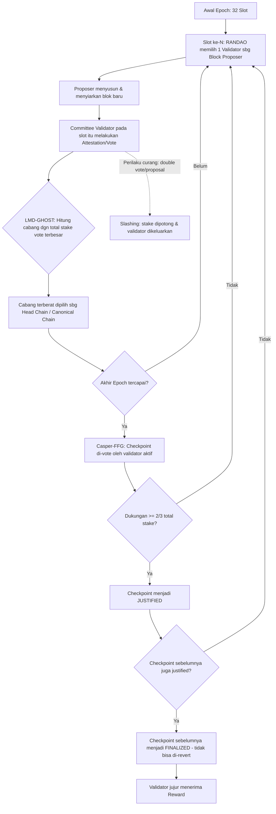

# Responsi Praktikum Sistem Terdistribusi dan Terdesentralisasi (FIF25002P)

| Dosen |
| --- |
| Dr. Bambang Purnomosidi D. P. |

| Nama | NIM | KELAS | Semester |
| --- | --- | --- | --- | 
| M Raka Aiko P | 235410023 | Informatika 1| Genap 2025/2026 |

Repo ini berisi jawaban Responsi untuk 3 CPMK, dikerjakan pada **Windows** menggunakan **Docker Desktop**, **YugabyteDB**, dan **Python (Flask)**.

---

## Daftar Isi
1. [CPMK 1 - YugabyteDB dengan Docker (20%)](#cpmk-1---yugabytedb-dengan-docker-20)
2. [CPMK 2 - REST API dengan Python (40%)](#cpmk-2---rest-api-dengan-python-40)
3. [CPMK 3 - Mekanisme Konsensus Blockchain L1 (40%)](#cpmk-3---mekanisme-konsensus-blockchain-l1-40)

---

## CPMK 1 - YugabyteDB dengan Docker (20%)

### 1. Persiapan (Windows)
Pastikan **Docker Desktop** sudah terinstall dan berjalan (WSL2 backend aktif), lalu jalankan PowerShell di folder repo ini:

```powershell
docker-compose up -d
docker ps
```


Tunggu sampai container `yugabytedb-node1` berstatus `healthy`/`Up`. Cek YugabyteDB UI di browser:

```
http://localhost:7000   -> Master UI
http://localhost:9000   -> TServer UI
```


### 2. Masuk ke ysqlsh
```powershell
docker exec -it yugabytedb-node1 ysqlsh -h yugabytedb-node1
```


### 3. Membuat 2 tabel dan mengisi 5 data


```powershell
docker cp sql/init.sql yugabytedb-node1:/home/yugabyte/init.sql
docker exec -it yugabytedb-node1 ysqlsh -h yugabytedb-node1 -f /home/yugabyte/init.sql
```

Skrip ini membuat database `responsi_db` dengan 2 tabel:


| Tabel     | Kolom                                              | Jumlah Data |
|-----------|-----------------------------------------------------|-------------|
| `pegawai` | id, nama, jabatan, departemen, gaji                 | 5           |
| `produk`  | id, nama_produk, kategori, harga, stok              | 5           |

### 4. Bukti tabel & data berhasil dibuat
Jalankan verifikasi berikut lalu **screenshot hasilnya** dan simpan di folder `screenshots/`:

```sql
\c responsi_db
\dt
SELECT * FROM pegawai;
SELECT * FROM produk;
```


#### Penjelasan:
1. Menyiapkan environment Docker di Windows (Docker Desktop) untuk menjalankan database terdistribusi.
2. Menulis docker-compose.yml yang mendefinisikan satu service container bernama yugabytedb-node1, menggunakan image resmi yugabyte/yugabyte, dengan port-port penting dipetakan ke localhost (7000 untuk Master UI, 9000 untuk TServer UI, 5433 untuk YSQL/koneksi SQL).
3. Menjalankan container dengan docker-compose up -d, sehingga YugabyteDB aktif dan bisa menerima koneksi SQL di localhost:5433.
4. Merancang skema data sendiri (bebas sesuai ketentuan soal): dua tabel —
- pegawai (id, nama, jabatan, departemen, gaji)
- produk (id, nama_produk, kategori, harga, stok)
5. Menulis skrip SQL (init.sql) berisi:
- CREATE DATABASE responsi_db
- CREATE TABLE untuk kedua tabel di atas
- INSERT 5 baris data ke masing-masing tabel
6. Mengeksekusi skrip itu ke dalam container lewat ysqlsh (client SQL YugabyteDB), sehingga database, tabel, dan data benar-benar tercipta di dalam server YugabyteDB yang berjalan di Docker.
7. Membuktikan hasil kerja dengan menjalankan perintah verifikasi (\dt untuk daftar tabel, SELECT * FROM pegawai; dan SELECT * FROM produk; untuk isi data), lalu didokumentasikan lewat screenshot sebagai bukti bahwa kedua tabel dan datanya benar-benar tersimpan di database terdistribusi tersebut.
#### Hasil akhir nomor 1:
Hasil akhir nomor 1: sebuah instance YugabyteDB yang berjalan di container Docker, berisi database responsi_db dengan 2 tabel yang masing-masing terisi 5 baris data, dan sudah diverifikasi secara langsung lewat query SQL.

---

## CPMK 2 - REST API dengan Python (40%)

REST API dibuat menggunakan **Flask** dan **psycopg2** (karena YSQL YugabyteDB kompatibel dengan protokol PostgreSQL), mengekspos data tabel `pegawai` dan `produk` dalam format JSON.

Source code: [`api/app.py`](api/app.py)

### Cara menjalankan (Windows PowerShell)
```powershell
cd api
python -m venv venv
venv\Scripts\activate
pip install -r requirements.txt
python app.py
```


API akan berjalan di `http://localhost:5000`.

### Endpoint yang tersedia
| Method | Endpoint                | Deskripsi                          |
|--------|--------------------------|-------------------------------------|
| GET    | `/`                       | Info API & daftar endpoint          |
| GET    | `/api/pegawai`            | Semua data pegawai                  |
| GET    | `/api/pegawai/<id>`       | Data pegawai berdasarkan id         |
| GET    | `/api/produk`             | Semua data produk                   |
| GET    | `/api/produk/<id>`        | Data produk berdasarkan id          |

### Contoh akses via browser
```
http://localhost:5000/api/pegawai
http://localhost:5000/api/produk
```


### Contoh akses via curl (PowerShell)
```powershell
curl http://localhost:5000/api/pegawai
curl http://localhost:5000/api/produk/1
```


#### Penjelasan:
1. Membuat proyek Python terpisah (folder api/) dengan virtual environment (venv) agar dependency-nya terisolasi dari sistem.
2. Menentukan library yang dipakai: Flask untuk membangun web server/REST API, dan pg8000 sebagai driver koneksi ke YugabyteDB (dipilih karena kompatibel dengan protokol PostgreSQL dan tidak butuh proses compile native di Windows).
3. Menulis kode app.py yang berisi:
- Konfigurasi koneksi ke database YugabyteDB yang sudah dibuat di nomor 1 (host=localhost, port=5433, database=responsi_db).
- Fungsi query_all() sebagai helper untuk mengeksekusi query SQL dan mengubah hasilnya menjadi format Python (list of dict).
- 5 endpoint REST API: /, /api/pegawai, /api/pegawai/<id>, /api/produk, /api/produk/<id>.
4. Menjalankan server API dengan python app.py, sehingga Flask aktif dan mendengarkan request di http://localhost:5000.
5. Menguji setiap endpoint lewat browser dan/atau curl, memastikan data dari tabel pegawai dan produk yang dibuat di nomor 1 benar-benar bisa diambil dan tampil dalam format JSON yang valid.
6. Mendokumentasikan hasil pengujian (screenshot response JSON di browser/terminal) sebagai bukti bahwa REST API berhasil mengekspos data database ke luar.

#### Hasil akhir nomor 2:
sebuah REST API berbasis Python/Flask yang berjalan di localhost:5000, mampu mengambil data secara langsung dari database YugabyteDB (hasil nomor 1) dan menyajikannya sebagai response JSON yang bisa diakses lewat browser atau tool seperti curl.

---

## CPMK 3 - Mekanisme Konsensus Blockchain L1 (40%)

### Blockchain yang dipilih: **Ethereum (Layer 1, Proof-of-Stake)**

Ethereum dipilih karena merupakan salah satu blockchain L1 terbesar setelah bermigrasi penuh dari Proof-of-Work (PoW) ke Proof-of-Stake (PoS) melalui peristiwa **The Merge** (September 2022), dan mekanismenya cukup representatif untuk generasi blockchain modern non-Solana.

### Mekanisme Konsensus: Gasper (Casper-FFG + LMD-GHOST)

Ethereum PoS menggunakan protokol gabungan yang disebut **Gasper**, yang terdiri dari dua komponen utama:

1. **LMD-GHOST (Latest Message Driven - Greediest Heaviest Observed SubTree)**
   Berfungsi sebagai **fork-choice rule** — aturan untuk memilih rantai (chain) mana yang dianggap sah saat terjadi percabangan (fork). Validator memilih cabang dengan "berat" (jumlah stake yang mendukungnya) terbesar berdasarkan pesan/vote terbaru dari tiap validator.

2. **Casper-FFG (Friendly Finality Gadget)**
   Berfungsi sebagai mekanisme **finality** — menjadikan blok yang sudah cukup lama dan mendapat dukungan mayoritas sebagai **final** (tidak dapat di-revert lagi), melalui proses **checkpoint justification & finalization** setiap epoch (32 slot, ±6.4 menit).

### Alur Kerja Singkat
1. Waktu di Ethereum dibagi menjadi **slot** (12 detik) dan **epoch** (32 slot).
2. Di setiap slot, satu **validator** dipilih secara acak (berdasarkan stake dan algoritma RANDAO) sebagai **block proposer** untuk mengusulkan blok baru.
3. Validator lain dalam komite yang ditugaskan pada slot tersebut melakukan **attestation** (vote) terhadap blok tersebut.
4. **LMD-GHOST** menentukan cabang mana yang menjadi kanonik berdasarkan akumulasi attestation terbaru dari seluruh validator.
5. Setiap akhir epoch, **Casper-FFG** memproses checkpoint: jika ≥ 2/3 total stake yang aktif mem-vote sebuah checkpoint, checkpoint tersebut menjadi **justified**; jika dua checkpoint berurutan justified, checkpoint pertama menjadi **finalized**.
6. Validator yang bertindak jujur mendapat **reward**; validator yang melakukan tindakan berbahaya (misalnya menandatangani dua blok berbeda pada slot yang sama / *double voting*) akan terkena **slashing** (sebagian stake-nya dipotong dan dikeluarkan dari jaringan).

### Diagram Mekanisme Konsensus



> Catatan: diagram di atas menggunakan sintaks **Mermaid**, yang otomatis dirender oleh GitHub saat file markdown ini dibuka di repository.

### Mengapa Ini Berbeda dari Solana?
Solana menggunakan **Proof-of-History (PoH)** dikombinasikan dengan Proof-of-Stake (Tower BFT) untuk mempercepat kesepakatan waktu antar node, sedangkan Ethereum **tidak** menggunakan PoH — Ethereum mengandalkan slot/epoch berbasis wall-clock time dan mekanisme finality dua lapis (LMD-GHOST untuk fork-choice cepat + Casper-FFG untuk finality yang kuat/irreversible).

---
