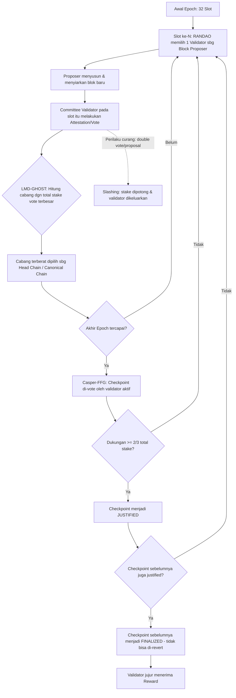

# Responsi Praktikum Sistem Terdistribusi dan Terdesentralisasi (FIF25002P)

**Nama** : _(isi nama Anda)_
**NIM** : _(isi NIM Anda)_
**Program Studi** : Informatika - S1
**Dosen** : Dr. Bambang Purnomosidi D. P.
**Semester** : Genap 2025/2026

Repo ini berisi jawaban Responsi untuk 3 CPMK, dikerjakan pada **Windows** menggunakan **Docker Desktop**, **YugabyteDB**, dan **Python (Flask)**.

---

## Daftar Isi
1. [CPMK 1 - YugabyteDB dengan Docker (20%)](#cpmk-1---yugabytedb-dengan-docker-20)
2. [CPMK 2 - REST API dengan Python (40%)](#cpmk-2---rest-api-dengan-python-40)
3. [CPMK 3 - Mekanisme Konsensus Blockchain L1 (40%)](#cpmk-3---mekanisme-konsensus-blockchain-l1-40)

---

## CPMK 1 - YugabyteDB dengan Docker (20%)

### 1. Persiapan (Windows)
Pastikan **Docker Desktop** sudah terinstall dan berjalan (WSL2 backend aktif), lalu jalankan PowerShell di folder repo ini:

```powershell
docker-compose up -d
docker ps
```

Tunggu sampai container `yugabytedb-node1` berstatus `healthy`/`Up`. Cek YugabyteDB UI di browser:

```
http://localhost:7000   -> Master UI
http://localhost:9000   -> TServer UI
```

### 2. Masuk ke ysqlsh
```powershell
docker exec -it yugabytedb-node1 ysqlsh -h yugabytedb-node1
```

### 3. Membuat 2 tabel dan mengisi 5 data
Jalankan skrip `sql/init.sql` (bisa copy-paste isinya ke ysqlsh, atau salin file ke dalam container lalu jalankan dengan `\i`):

```powershell
docker cp sql/init.sql yugabytedb-node1:/home/yugabyte/init.sql
docker exec -it yugabytedb-node1 ysqlsh -h yugabytedb-node1 -f /home/yugabyte/init.sql
```

Skrip ini membuat database `responsi_db` dengan 2 tabel:

| Tabel     | Kolom                                              | Jumlah Data |
|-----------|-----------------------------------------------------|-------------|
| `pegawai` | id, nama, jabatan, departemen, gaji                 | 5           |
| `produk`  | id, nama_produk, kategori, harga, stok              | 5           |

### 4. Bukti tabel & data berhasil dibuat
Jalankan verifikasi berikut lalu **screenshot hasilnya** dan simpan di folder `screenshots/`:

```sql
\c responsi_db
\dt
SELECT * FROM pegawai;
SELECT * FROM produk;
```

> 📸 **Tempelkan screenshot Anda di sini setelah dijalankan:**
> - `screenshots/01-docker-ps.png` — bukti container YugabyteDB berjalan
> - `screenshots/02-list-tables.png` — hasil `\dt` menampilkan 2 tabel
> - `screenshots/03-select-pegawai.png` — hasil `SELECT * FROM pegawai;` (5 baris)
> - `screenshots/04-select-produk.png` — hasil `SELECT * FROM produk;` (5 baris)
> - Alternatif: buka **YugabyteDB UI** (`http://localhost:15433` untuk YSQL/YB Web UI atau melalui `http://localhost:7000/tablet-servers`) dan screenshot daftar tabelnya.

---

## CPMK 2 - REST API dengan Python (40%)

REST API dibuat menggunakan **Flask** dan **psycopg2** (karena YSQL YugabyteDB kompatibel dengan protokol PostgreSQL), mengekspos data tabel `pegawai` dan `produk` dalam format JSON.

Source code: [`api/app.py`](api/app.py)

### Cara menjalankan (Windows PowerShell)
```powershell
cd api
python -m venv venv
venv\Scripts\activate
pip install -r requirements.txt
python app.py
```

API akan berjalan di `http://localhost:5000`.

### Endpoint yang tersedia
| Method | Endpoint                | Deskripsi                          |
|--------|--------------------------|-------------------------------------|
| GET    | `/`                       | Info API & daftar endpoint          |
| GET    | `/api/pegawai`            | Semua data pegawai                  |
| GET    | `/api/pegawai/<id>`       | Data pegawai berdasarkan id         |
| GET    | `/api/produk`             | Semua data produk                   |
| GET    | `/api/produk/<id>`        | Data produk berdasarkan id          |

### Contoh akses via browser
```
http://localhost:5000/api/pegawai
http://localhost:5000/api/produk
```

### Contoh akses via curl (PowerShell)
```powershell
curl http://localhost:5000/api/pegawai
curl http://localhost:5000/api/produk/1
```

### Contoh output JSON
```json
{
  "status": "success",
  "count": 5,
  "data": [
    {
      "id": 1,
      "nama": "Andi Saputra",
      "jabatan": "Backend Engineer",
      "departemen": "IT",
      "gaji": 9500000.00
    }
  ]
}
```

> 📸 **Tempelkan screenshot Anda di sini setelah dijalankan:**
> - `screenshots/05-api-running.png` — terminal menampilkan Flask berjalan di port 5000
> - `screenshots/06-browser-pegawai.png` — hasil akses `/api/pegawai` di browser
> - `screenshots/07-curl-produk.png` — hasil `curl` untuk `/api/produk`

---

## CPMK 3 - Mekanisme Konsensus Blockchain L1 (40%)

### Blockchain yang dipilih: **Ethereum (Layer 1, Proof-of-Stake)**

Ethereum dipilih karena merupakan salah satu blockchain L1 terbesar setelah bermigrasi penuh dari Proof-of-Work (PoW) ke Proof-of-Stake (PoS) melalui peristiwa **The Merge** (September 2022), dan mekanismenya cukup representatif untuk generasi blockchain modern non-Solana.

### Mekanisme Konsensus: Gasper (Casper-FFG + LMD-GHOST)

Ethereum PoS menggunakan protokol gabungan yang disebut **Gasper**, yang terdiri dari dua komponen utama:

1. **LMD-GHOST (Latest Message Driven - Greediest Heaviest Observed SubTree)**
   Berfungsi sebagai **fork-choice rule** — aturan untuk memilih rantai (chain) mana yang dianggap sah saat terjadi percabangan (fork). Validator memilih cabang dengan "berat" (jumlah stake yang mendukungnya) terbesar berdasarkan pesan/vote terbaru dari tiap validator.

2. **Casper-FFG (Friendly Finality Gadget)**
   Berfungsi sebagai mekanisme **finality** — menjadikan blok yang sudah cukup lama dan mendapat dukungan mayoritas sebagai **final** (tidak dapat di-revert lagi), melalui proses **checkpoint justification & finalization** setiap epoch (32 slot, ±6.4 menit).

### Alur Kerja Singkat
1. Waktu di Ethereum dibagi menjadi **slot** (12 detik) dan **epoch** (32 slot).
2. Di setiap slot, satu **validator** dipilih secara acak (berdasarkan stake dan algoritma RANDAO) sebagai **block proposer** untuk mengusulkan blok baru.
3. Validator lain dalam komite yang ditugaskan pada slot tersebut melakukan **attestation** (vote) terhadap blok tersebut.
4. **LMD-GHOST** menentukan cabang mana yang menjadi kanonik berdasarkan akumulasi attestation terbaru dari seluruh validator.
5. Setiap akhir epoch, **Casper-FFG** memproses checkpoint: jika ≥ 2/3 total stake yang aktif mem-vote sebuah checkpoint, checkpoint tersebut menjadi **justified**; jika dua checkpoint berurutan justified, checkpoint pertama menjadi **finalized**.
6. Validator yang bertindak jujur mendapat **reward**; validator yang melakukan tindakan berbahaya (misalnya menandatangani dua blok berbeda pada slot yang sama / *double voting*) akan terkena **slashing** (sebagian stake-nya dipotong dan dikeluarkan dari jaringan).

### Diagram Mekanisme Konsensus



> Catatan: diagram di atas menggunakan sintaks **Mermaid**, yang otomatis dirender oleh GitHub saat file markdown ini dibuka di repository.

### Mengapa Ini Berbeda dari Solana?
Solana menggunakan **Proof-of-History (PoH)** dikombinasikan dengan Proof-of-Stake (Tower BFT) untuk mempercepat kesepakatan waktu antar node, sedangkan Ethereum **tidak** menggunakan PoH — Ethereum mengandalkan slot/epoch berbasis wall-clock time dan mekanisme finality dua lapis (LMD-GHOST untuk fork-choice cepat + Casper-FFG untuk finality yang kuat/irreversible).

---

## Struktur Repository

```
responsi-disdec-sys/
├── README.md              # Dokumen jawaban ini
├── docker-compose.yml      # Menjalankan YugabyteDB (CPMK 1)
├── sql/
│   └── init.sql            # Script pembuatan 2 tabel + 5 data masing-masing
├── api/
│   ├── app.py               # REST API Python/Flask (CPMK 2)
│   └── requirements.txt
└── screenshots/             # Bukti hasil eksekusi (CPMK 1 & 2)
```
